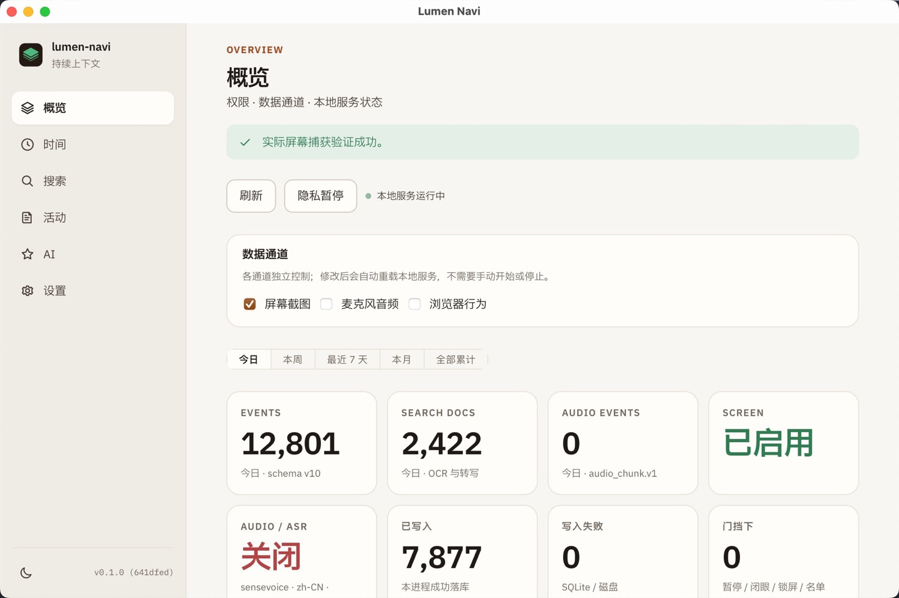
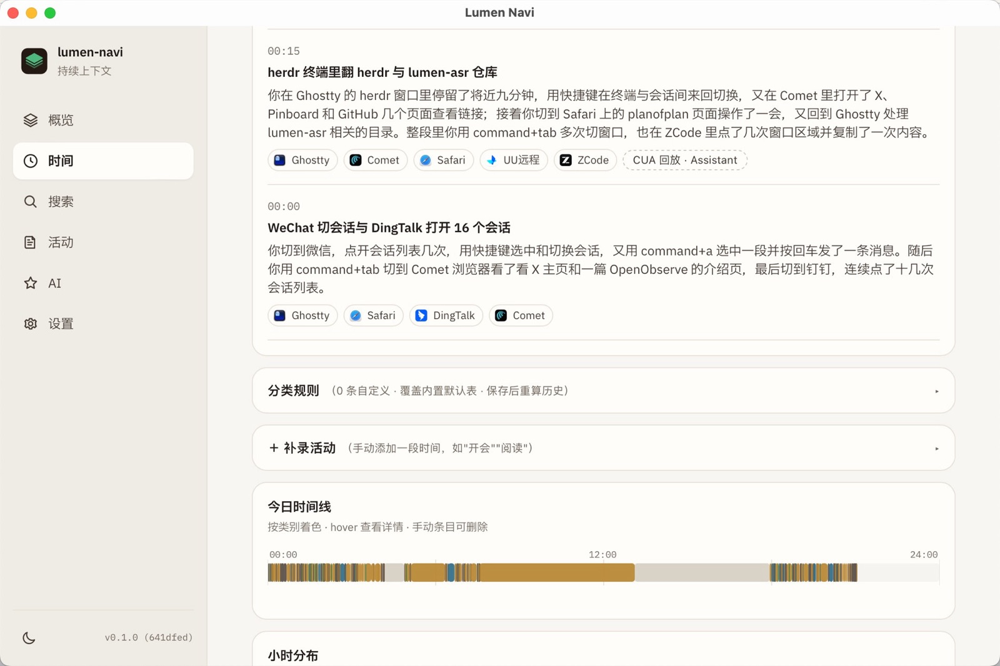

# Lumen Navi

Local-first **continuous context**. Watch the screen (and optionally the mic), keep it on your machine, and turn the day into a timeline you can search — and, if you want, talk to.

**Repo:** https://github.com/fakechris/lumen-navi

<p align="center">
  
</p>
<p align="center">
  
</p>

## One-liner

**Keep watching what matters — then make that stream useful, without sending it to a hosted service.**

## What it does

| Surface | What you get |
|---------|----------------|
| **Observe** | Smart screenshots (focus / visual change / 2-min liveness overwrite). Optional mic + local ASR. Hard gates: pause, closed-eyes, lock, app blocklist. |
| **Time** | Frontmost-app tracking, idle vs away, 15-minute History cards with LLM narrative, app/scene ranking, day timeline. |
| **Search** | On-device OCR + transcript FTS over what was on screen. |
| **AI** | Optional local/OpenAI-compat Roast and Chat over the day's evidence. Conservative CUA-replay chips on long stretches. |
| **Act (optional)** | Selection popup today; computer-use later via MIT **cua-driver** only. Never used for capture. |

All of it stays under `~/Library/Application Support/LumenNavi/` (Windows: `%LOCALAPPDATA%\LumenNavi\`).

## Architecture

| Plane | Role | Status |
|-------|------|--------|
| **Observe** | Multi-source intake | Screen + mic productized; browser extension optional |
| **Memory** | Durable store + async process | SQLite + FTS + jobs (OCR / AX / ASR) |
| **Act** | Optional computer-use | Selection popup now; **cua-driver** (MIT) later |

Full write-up: [`docs/ARCHITECTURE.md`](docs/ARCHITECTURE.md) · roadmap: [`docs/PLAN.md`](docs/PLAN.md) · capture policy: [`docs/OBSERVE_CAPTURE.md`](docs/OBSERVE_CAPTURE.md)

## Status

| Area | Status |
|------|--------|
| Screen Observe + OCR | ✅ (manual soak still open) |
| Time tracking + 15-min History cards | ✅ |
| Audio + Observe ASR | ✅ (SenseVoice default; Whisper / Speech / Qwen HTTP) |
| Desktop app (macOS) | ✅ |
| Windows 10/11 x64 | ✅ port; hardware soak pending — [`WINDOWS_PORT_STATUS.md`](docs/WINDOWS_PORT_STATUS.md) |
| Chrome Observe | ✅ implementation; soak pending |
| System audio / full Act | later |

## Install

Stable tags publish macOS DMGs (Apple Silicon + Intel) and a Windows x64 NSIS installer:

**[GitHub Releases](https://github.com/fakechris/lumen-navi/releases)** — current: **[v0.2.0](https://github.com/fakechris/lumen-navi/releases/tag/v0.2.0)**

Install notes (permissions, Gatekeeper, checksums): [`docs/DESKTOP_RELEASE_NOTES.md`](docs/DESKTOP_RELEASE_NOTES.md).

Screen Recording is owned by the nested **Lumen Cua** helper (`/Applications/Lumen Cua.app`). Start Observe from the Navi app so Cua can request it.

## Workspace

```
lumen-navi/
├── crates/          # daemon + libraries
├── apps/desktop/    # Tauri 2 shell (macOS + Windows)
├── extensions/      # Chrome Browser Observe MVP
└── docs/
```

## Quick start (from source)

```bash
cargo test
# Desktop (signed sidecars required for screen capture on macOS):
bash scripts/macos/tauri-dev-signed.sh
# or a release-shaped local build:
scripts/macos/build-desktop-release.sh aarch64-apple-darwin dmg
```

Default continuous ASR is **SenseVoice** (local sherpa-onnx). Models live under the **shared Lumen cluster** path  
`~/Library/Application Support/Lumen/models/` (override with `LUMEN_MODELS_DIR` / `asr.models_root`).  
See [`docs/AUDIO_PRODUCT.md`](docs/AUDIO_PRODUCT.md) and [`docs/DESKTOP.md`](docs/DESKTOP.md).

```bash
# search while the daemon is up
curl -s 'http://127.0.0.1:7420/v1/ocr/search?q=关键词&limit=5' | jq .
```

### Time-tracking categories (rules, not code)

App categories use a **fixed match engine** + **editable JSON rules** (no rebuild to tune keywords):

- Spec & usage: [`crates/lumen-store/rules/README.md`](crates/lumen-store/rules/README.md)
- Live overrides: `~/Library/Application Support/LumenNavi/rules/`

## Browser Observe

The Chrome MV3 extension records a privacy-gated lifecycle stream into its own local IndexedDB archive and can optionally sync a transport copy into the local daemon. Page content remains metadata-only unless the host is on an explicit allow-list. No HTML, input values, selections, clipboard data, or DOM link lists are collected.

[`docs/BROWSER_CAPTURE.md`](docs/BROWSER_CAPTURE.md)

## Related projects

| Project | Link | Relationship |
|---------|------|----------------|
| **Lumen ASR** | https://github.com/fakechris/lumen-asr | Separate **voice dictation** product. Share patterns only; **not** merged. |
| **lumen-suite** | https://github.com/fakechris/lumen-suite | Shared ASR engines, model contract, transcript interchange (git deps). |
| **cua-driver** | https://github.com/trycua/cua | Open-source **MIT** computer-use for optional **Act**. Never for Observe. |

## Config highlights

| Key | Default |
|-----|---------|
| `capture.*` | multi-display, probe, debounce, 2-min liveness — `docs/OBSERVE_CAPTURE.md` |
| `capture.idle_session_ms` | `300000` (5 min HID silence → away) |
| `audio.sample_rate` / `chunk_ms` | 16000 / 3000 |
| `asr.enabled` / `locale` | true / `zh-CN` |
| `ocr.enabled` | true |
| `api.bind` | `127.0.0.1:7420` |
| `sources.browser` | `false` |

**cua-driver is not used for capture/OCR/ASR.**

## License

Lumen Navi is licensed under the [GNU General Public License v3.0 only](LICENSE).
