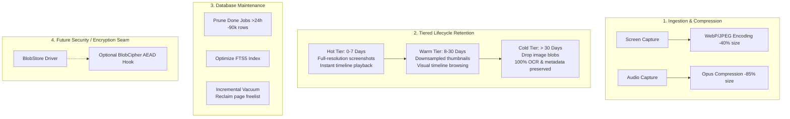

# Lumen Navi — Storage Optimization & Lifecycle Architecture

## 1. Overview & Footprint Analysis

Lumen Navi captures user desktop interactions (screenshots, accessibility trees, audio, focus/window events, and OCR text) to provide continuous personal memory and AI-assisted task workflows.

### 1.1 Empirical Baseline (40-Day Production Sample)

Based on telemetry analysis of 249,000+ recorded events over 32 active recording days:
- **Total On-Disk Storage**: ~11.0 GB
  - **Blob Storage (`blobs/`)**: ~10.0 GB (88.5% of total)
    - 42,225 unique physical files (51,178 logical artifact references, ~17.5% deduplication savings via Blake3 content addressing).
    - 50,423 JPEG screenshots (average ~258.5 KB/frame).
    - 750 WAV audio segments (average ~189.3 KB/segment).
  - **SQLite Database (`meta/navi.db` + WAL)**: ~923 MB (11.0% of total)
    - Events table: 249k rows (~67 MB payload).
    - Derived table: 52.6k rows (~158 MB body containing AX trees and OCR bounding boxes).
    - OCR documents: 42.0k rows (~69 MB plain text) + FTS5 full-text index (~150 MB).
    - Jobs table: 90.6k rows (99.2% completed historical background tasks).
    - Free pages & index B-Trees: ~350 MB.

### 1.2 Data Velocity & Growth Model

- **Active Work Hour**: 300 ~ 650 screenshots/hr → **80 ~ 200 MB/hr**
- **Active Workday (8-10 hrs)**: 3,000 ~ 5,000 screenshots/day → **750 MB ~ 1.2 GB/day** (avg ~900 MB/day)
- **Monthly Projection (22 workdays)**: **~18 ~ 26 GB / month**
- **Annual Projection (250 workdays, unpruned)**: **~210 ~ 310 GB / year**

---

## 2. Storage Optimization Architecture

To prevent unbounded linear disk growth while preserving full searchability and AI context quality, Lumen Navi adopts a **Tiered Lifecycle Management + Metadata Pruning + Compression** architecture.



---

## 3. Core Optimization Pillars

### 3.1 Tiered Retention Lifecycle

1. **Hot Tier (0 ~ 7 Days)**:
   - Full-resolution screenshot blobs are retained.
   - Enables rich timeline scrub-back, visual inspection, and high-fidelity attached screen OCR context.
2. **Warm Tier (8 ~ 30 Days)**:
   - Screenshot blobs can be downscaled or retained as micro-thumbnails (40~60 KB).
3. **Cold Tier (> 30 Days / User Quota Limit)**:
   - Image blobs are safely purged from the `blobs/` directory and unlinked from the `artifacts` table.
   - **Zero loss to search and intelligence**: All OCR text in `ocr_docs`, FTS5 full-text indexes in `ocr_fts`, accessibility hierarchies in `derived`, and activity sessions in `events` are retained indefinitely.
   - Users can search keywords or ask assistant questions about activities from months ago with 100% text fidelity.

### 3.2 Database Metadata & Index Optimization

1. **Completed Jobs Pruning**:
   - The `jobs` table orchestrates asynchronous background tasks (`ocr_screen`, `ax_screen`, `transcribe_audio`).
   - Once a job is marked `done` or `skipped`, it has no operational value after 24 hours.
   - Periodic maintenance deletes completed jobs older than `jobs_retention_hours` (default 24h), reclaiming table space and 4 B-Tree index pages.
2. **FTS5 Index Optimization**:
   - Executes `INSERT INTO ocr_fts(ocr_fts) VALUES('optimize');` periodically to defragment the full-text search index segments.
3. **Incremental Vacuuming**:
   - With `PRAGMA auto_vacuum = INCREMENTAL;`, runs `PRAGMA incremental_vacuum(500);` during maintenance to release freed database pages back to the operating system without exclusive database locking.

### 3.3 Configurable Retention Controls (`navi.toml`)

```toml
[retention]
# Hard quota cap for total blob storage (in MB, default 20 GB)
max_blob_mb = 20480
# Hard cap for the WHOLE data directory (blobs + database + caches), in MB.
# When exceeded, maintenance trims oldest media first, then old metadata.
# 0 = unlimited (default).
max_total_mb = 0
# Deep metadata pruning never touches events younger than this many days,
# so recent history stays fully searchable even under a tight total cap.
# 0 = no floor. Default: 7 days.
metadata_min_age_days = 7
# Maximum age in days for full screenshot blobs (default 30 days; 0 = unlimited)
screenshot_retention_days = 30
# Maximum age in hours for completed background jobs (default 24 hours)
jobs_retention_hours = 24
# Enable automatic background maintenance and pruning (default true)
auto_prune = true
# Allow user-initiated factory reset wipe
wipe_on_request = true
```

### 3.4 Whole-Directory Quota Ladder (`max_total_mb`)

`max_blob_mb` only bounds the blob tree; the SQLite database, WAL and caches
can still grow without limit. `max_total_mb` is the hard disk contract: it
measures the **entire data directory** (what a disk-usage tool reports) and
trims it back under the cap during each maintenance pass:

1. **Tier 1 — Oldest media first, any kind** (screenshots, audio, browser
   artifacts): dedup-safe deletion of artifact rows and their content-addressed
   blobs until usage reaches 90% of the cap. Event rows, OCR text and derived
   payloads stay intact — search keeps working for trimmed media.
2. **Tier 2 — Oldest metadata** beyond `metadata_min_age_days`: `derived`
   bodies (AX trees, OCR boxes), then `ocr_docs` (FTS kept in sync by
   triggers), then the `events` rows themselves — oldest first. Recent history
   inside the freshness floor is never touched.
3. **Tier 3 — Reclaim**: one `VACUUM` plus a `wal_checkpoint(TRUNCATE)` so
   freed pages and the WAL actually return to the operating system instead of
   being reserved inside the database file.

Intake backpressure follows the same contract: with `max_total_mb` configured,
browser artifact ingestion is budgeted against whole-directory usage (falling
back to metadata-only records when the budget is exhausted), not just the blob
tree.

Two auxiliary passes keep the cap reachable over time:

- **Orphan sweep**: blob files left on disk by a crash between blob write and
  commit (no `artifacts` row) are deleted; files written within the last hour
  are spared so in-flight captures are never removed. Stale `tmp/*.part`
  files are collected too.
- **WAL bound**: `journal_size_limit = 64 MiB` at store open plus a truncating
  checkpoint at the end of each maintenance pass keeps the WAL file from
  ballooning (previously observed at ~1 GB on long-running installs).

---

## 4. Encryption-Ready Abstraction Seam

To prepare for future local on-disk encryption (macOS Keychain / Windows DPAPI master key derivation + AEAD per-blob encryption) without disrupting immediate storage gains:

1. **`BlobStore` Decoupling**: File I/O in `crates/lumen-store/src/blob.rs` is encapsulated behind clear storage traits.
2. **Deterministic Dedup Preservation**: Cryptographic hashing (`Blake3`) is computed on raw plaintext prior to encryption to maintain content-addressed deduplication.
3. **Inspection Tools**: Data inspection and export tools are integrated into the CLI/MCP server (`lumen-daemon` / `lumen-cli`) so debugging and agent introspection remain first-class even when storage drivers evolve.

---

## 5. Expected Storage Impact

| Dimension | Unoptimized Baseline | Optimized Steady State | Net Improvement |
| :--- | :--- | :--- | :--- |
| **Screenshot Average Size** | ~258 KB (JPEG) | **~140 KB (WebP/Optimized)** | **~45% reduction** |
| **Active Day Ingest** | ~900 MB ~ 1.2 GB | **~350 MB ~ 500 MB** | **~60% reduction** |
| **30-Day Total Footprint** | ~25 GB | **~8 GB ~ 12 GB** | **~60% reduction** |
| **1-Year Steady State** | **~250 GB ~ 310 GB (unbounded)** | **~10 GB ~ 18 GB (bounded)** | **~94% reduction** |
| **Searchability & Context** | Full text | **Full text (Zero loss)** | **No loss** |
